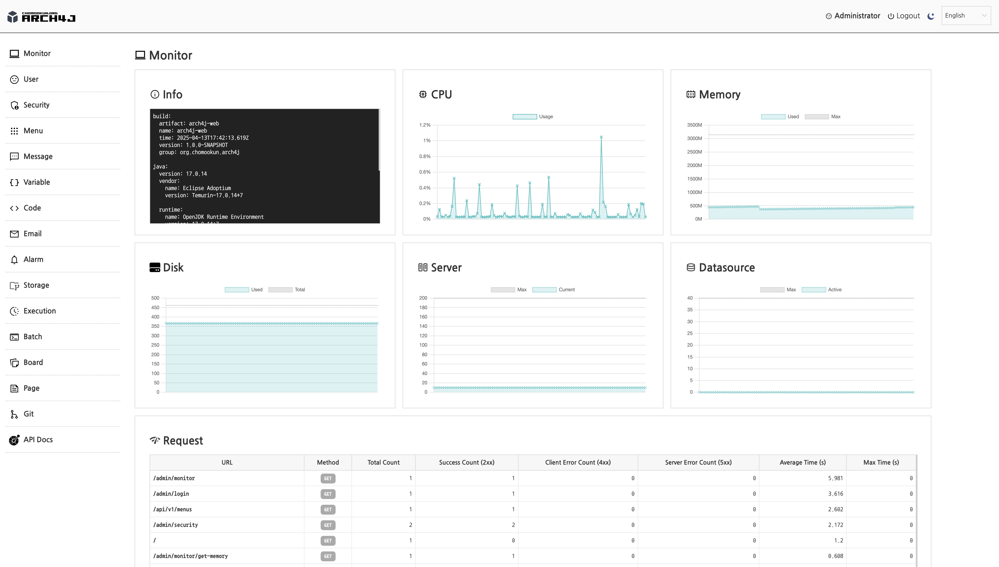
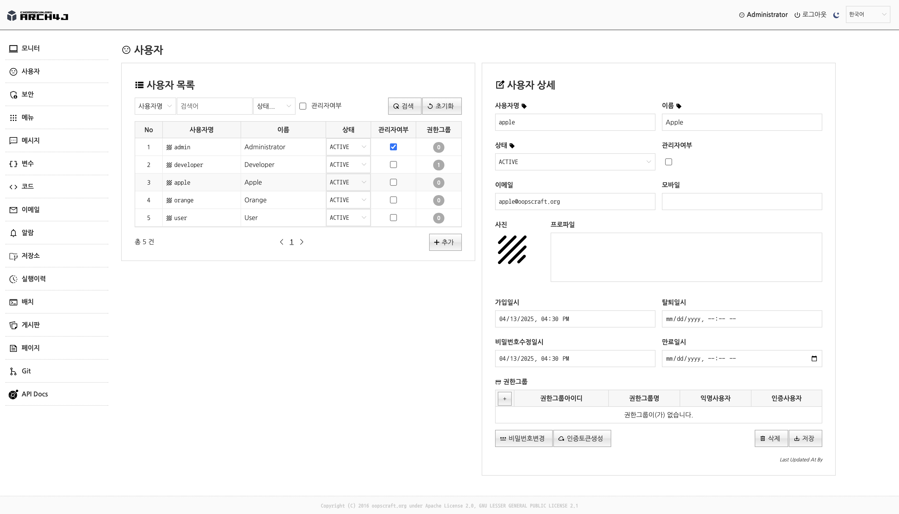
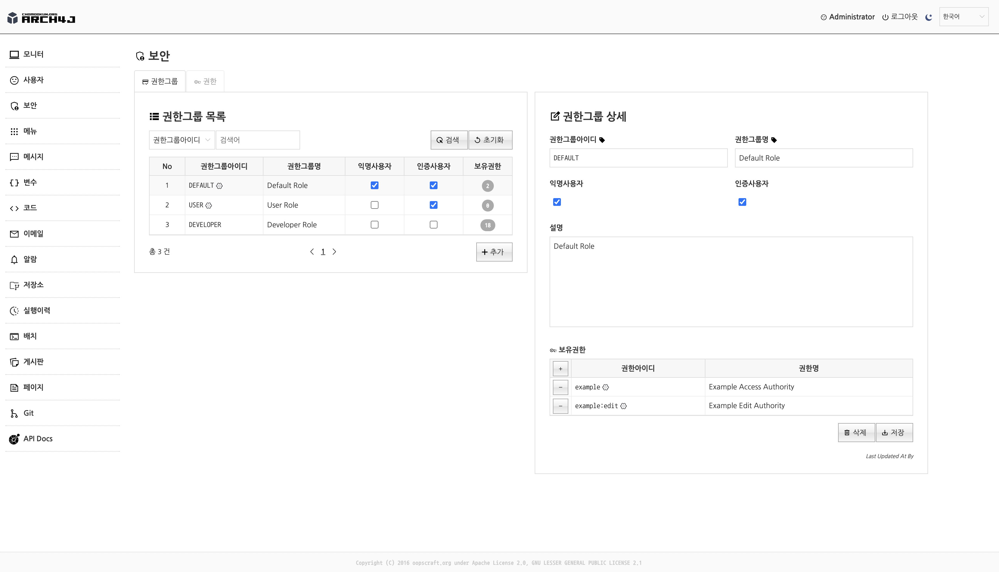
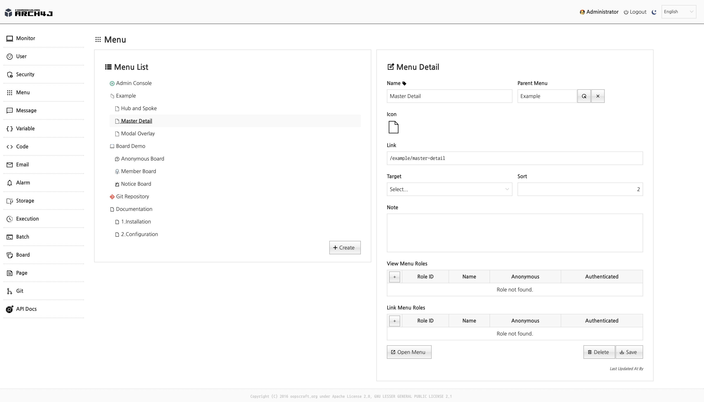
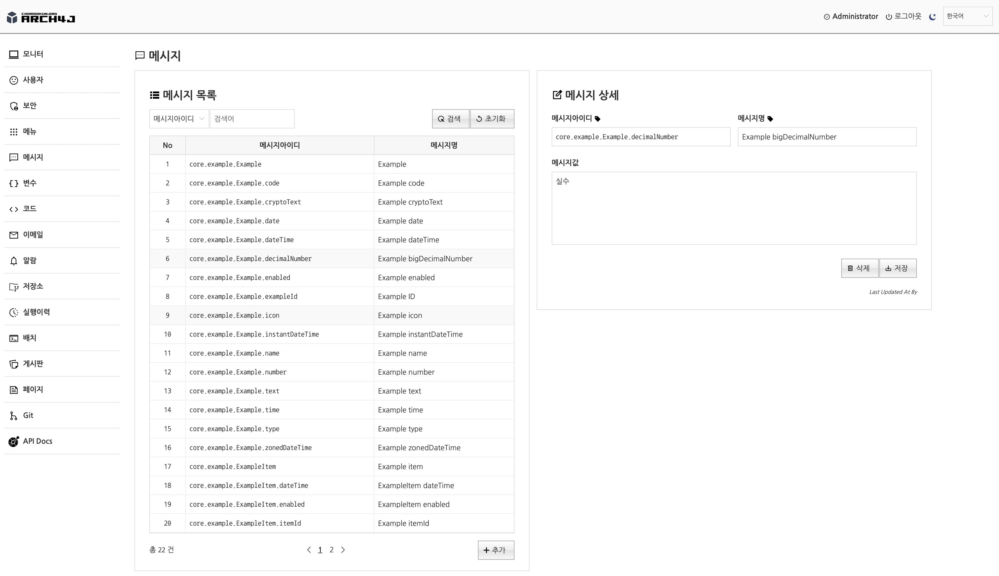

# ARCH4J (Application Archetype for Java) 

[](https://github.com/sponsors/chomookun)
[](https://ko-fi.com/chomookun)

spring-boot-based archetype for web application, batch application, CLI(Command Line Interface) application.


| Subproject                                                                         | Description                              |
|------------------------------------------------------------------------------------|------------------------------------------|
| **arch4j-core**                                                                    | Shared core component archetype project  |
| **arch4j-web**                                                                     | web application archetype project        |
| **arch4j-shell**                                                                   | Shell(CLI) application archetype project |
| **arch4j-batch**                                                                   | Batch application archetype project      |


## 🖥️ Demo site

Credentials: developer/developer

### [](https://gcp.arch4j-web.chomookun.org)

Due to a cold start, there is an initialization delay of approximately 30 seconds.<br/>
Trading daemon is not available on the demo site.<br/>
(No money!!!)

### [](https://arch4j-web.chomookun.org)

The service is hosted on a personal home server, so performance may be slower.
(No money!!!)


## 🧪 Running from source

### Starts arch4j-daemon
Runs the daemon application.
```shell
# starts fintics-daemon
./gradlew :arch4j-daemon:bootRun
```

### Starts arch4j-web
Runs web application.
```shell
# starts arch4j-web
./gradlew :arch4j-web:bootRun
```

## 🧪 Running from release binary

Downloads Released archives.

### Starts arch4j-daemon

```shell
./bin/arch4j-daemon
```

### Starts arch4j-web
```shell
./bin/arch4j-web
```

## 🧪 Running from container image

### Starts arch4j-daemon
```shell
docker run -rm -p 8081:8081 docker.io/chomoookun/arch4j-daemon:latest
```

### Starts arch4j-web
```shell
docker run -rm -p 8080:8080 docker.io/chomoookun/arch4j-web:latest
```


## 🔗 References

### [](https://github.com/chomookun/arch4j)
Git source repository

### [](https://github.com/chomookun/duice)
UI Component javascript library


## 📁 Main features

### 🖥️ Monitor

Provides simple application monitor admin.<br/>
(info, cpu, mem, disk, server thread, datasource, requests ...)




### 😳 User

Offers a user management module that integrates with a database.<br/>
It's based on spring-security.




### 🔐 Security (Role, Authority)

Offers a spring-security(role,authority) module that integrates with a database.<br/>




### 📋 Menu

Offers dynamic menu module with database. (supports i18n)




### 💬 Message

Offers combined message (spring message + database message) module. (support i18n)




### 🪪 Variable


### ⌥ Code


### ✉️ Email


### 🔔 Alarm


### 💾 Storage


### 💨 Execution


### 📦 Batch


### 🧾 Board


### 📃 Page


### 📚 Git


