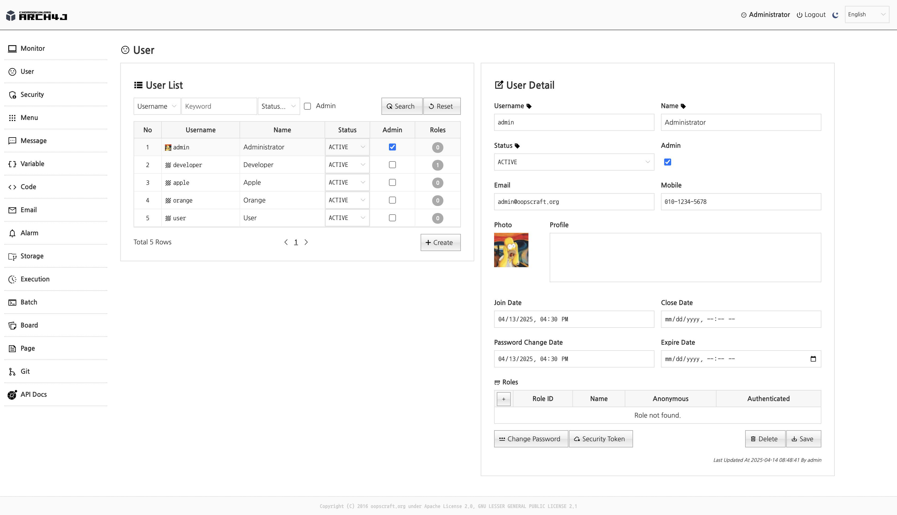
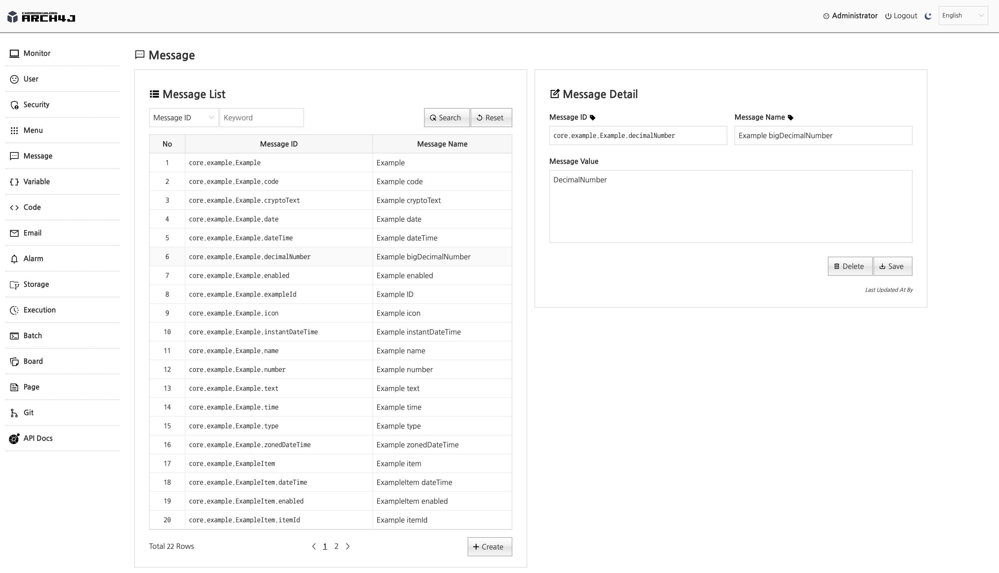
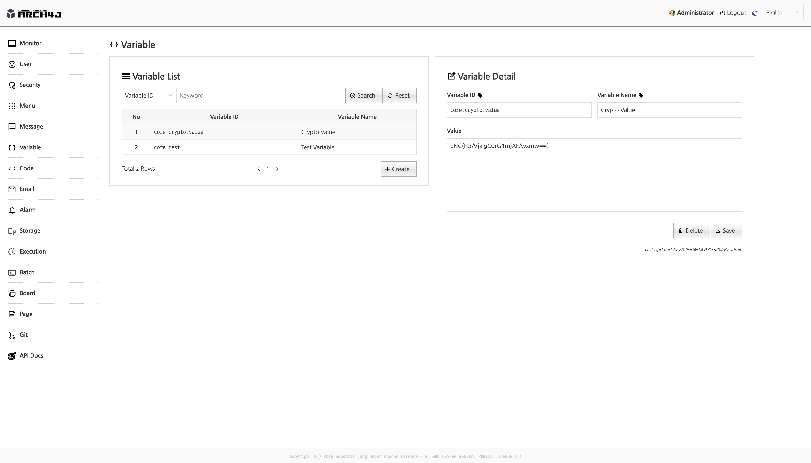
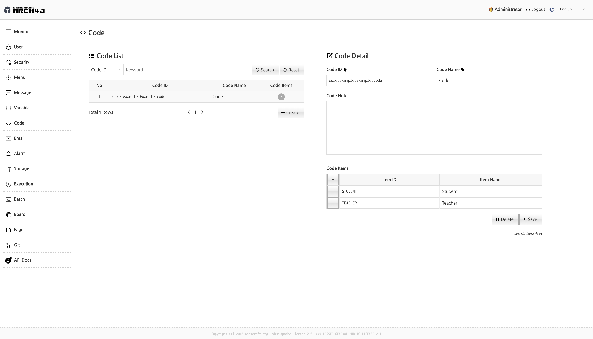
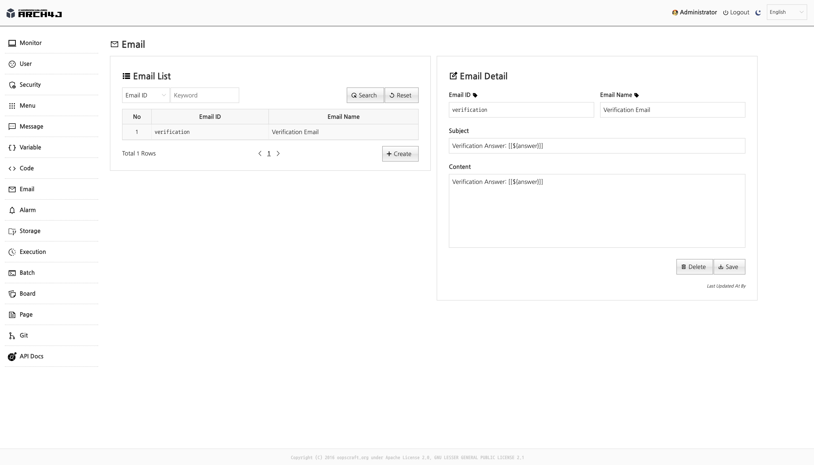
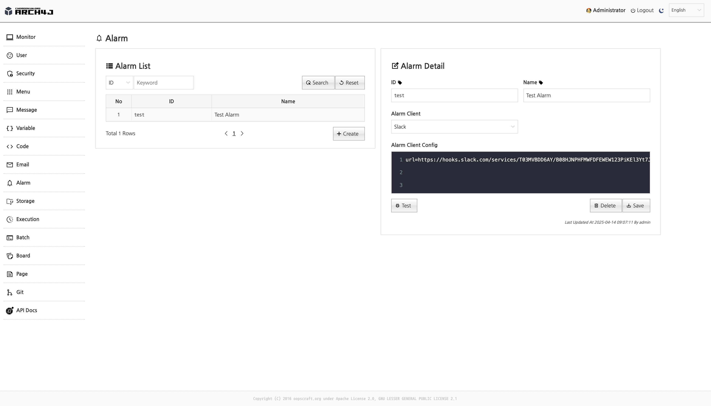
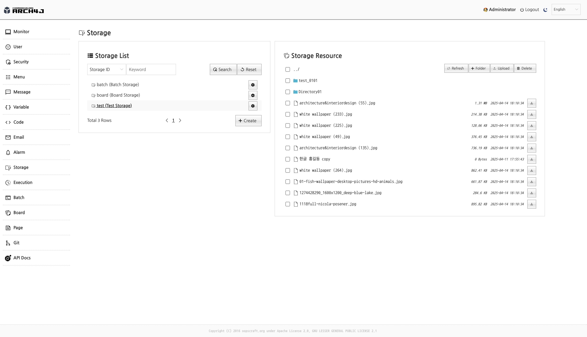
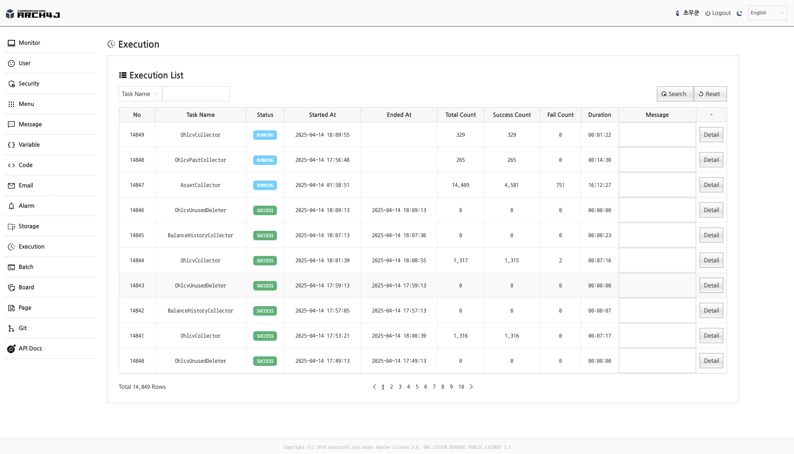
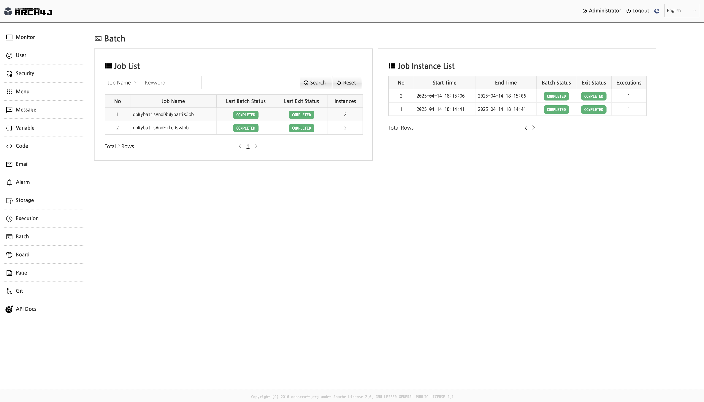

# ARCH4J (Application Archetype for Java) 

[](https://github.com/sponsors/chomookun)
[](https://ko-fi.com/chomookun)

spring-boot-based archetype for web application, batch application, CLI(Command Line Interface) application.


| Subproject                                                                         | Description                              |
|------------------------------------------------------------------------------------|------------------------------------------|
| **arch4j-core**                                                                    | Shared core component archetype project  |
| **arch4j-web**                                                                     | web application archetype project        |
| **arch4j-shell**                                                                   | Shell(CLI) application archetype project |
| **arch4j-batch**                                                                   | Batch application archetype project      |


---


## 🖥️ Demo site

Credentials: **developer/developer**

### Self-hosting
[](https://arch4j-web.chomookun.org)
<br/>
The service is hosted on a personal home server, so performance may be slower.
(No money!!!)

### Google cloud run
[](https://gcp.arch4j-web.chomookun.org)
<br/>
Due to a cold start, there is an initialization delay of approximately 30 seconds.<br/>
Trading daemon is not available on the demo site.<br/>
(No money!!!)


---


## 🧪 Running from source

### Starts arch4j-daemon
Runs the daemon application.
```shell
# starts fintics-daemon
./gradlew :arch4j-daemon:bootRun
```

### Starts arch4j-web
Runs web application.
```shell
# starts arch4j-web
./gradlew :arch4j-web:bootRun
```

---

## 🧪 Running from release binary

Downloads Released archives.

### Starts arch4j-daemon

```shell
./bin/arch4j-daemon
```

### Starts arch4j-web
```shell
./bin/arch4j-web
```

---

## 🧪 Running from container image

### Starts arch4j-daemon
```shell
docker run -rm -p 8081:8081 docker.io/chomoookun/arch4j-daemon:latest
```

### Starts arch4j-web
```shell
docker run -rm -p 8080:8080 docker.io/chomoookun/arch4j-web:latest
```

---

## 🔗 References

### Git source repository
[](https://github.com/chomookun/arch4j)

### UI Component javascript library
[](https://github.com/chomookun/duice)

---

## 📁 Main features

### 🖥️ Monitor

Provides simple application monitor admin.<br/>
(info, cpu, mem, disk, server thread, datasource, requests ...)


### 😳 User

Offers a user management module that integrates with a database.<br/>
It's based on spring-security.




### 🔐 Security (Role, Authority)

Offers a spring-security(role,authority) module that integrates with a database.<br/>


### 📋 Menu

Offers dynamic menu module with database. (supports i18n)


### 💬 Message

Offers combined message (spring message + database message) module. (support i18n)




### 🪪 Variable

Offers crypto-supported variable module.



If you enter **DEC([real value)])**, saves as **ENC([encrypted value])** to protect sensitive data.


### ⌥ Code

Provides database code store module.




### ✉️ Email

Provides email template module.(template engine is thymeleaf syntax)




### 🔔 Alarm

Provides an alarm message sending module.




### 💾 Storage

Provides file management capabilities for storage.




### 💨 Execution

Provides a feature to store execution history of background tasks.




### 📦 Batch

Provides metadata management functionality for Spring Batch.



---

## 📁 Sub features


### 🔒 Configuration security feature with PBE

Enters ENC([encrypted value]) in the configuration file.

```yml
spring:
  datasource:
    hikari:
      ...
      username: ENC(iqTD9xHUch57rODDJr163Q==) 
      ...
```

Inject secret password in runtime.

```shell
# from environment variable
export JASYPT_ENCRYPTOR_PASSWORD=[Your secret password]

# from command line argument
java -jar app.jar --jasypt.encryptor.password=[Your secret password]
```

### 🔒 Data security (encryption) feature

### JPA Entity with CryptoConverter
```java
@Entity
@Table(name = "core_example")
public class ExampleEntity extends BaseModel {
    ...
    @Column(name = "crypto_text", length = Integer.MAX_VALUE)
    @Lob
    @Convert(converter = CryptoConverter.class)
    private String cryptoText;
    ...
}
```

### Mybatis with TypeHandler
```xml
<resultMap id="exampleVo" type="org.chomookun.arch4j.core.example.vo.ExampleVo">
    ...
    <result property="cryptoText" column="crypto_text" typeHandler="org.chomookun.arch4j.core.common.data.typehandler.CryptoTypeHandler"/>
    ...
</resultMap>

<insert id="insertExample">
insert into core_example (
    ...
    crypto_text
    ...
) values (
    ...
    #{cryptoText, typeHandler=org.chomookun.arch4j.core.common.data.typehandler.CryptoTypeHandler}
    ...
)
</insert>
```